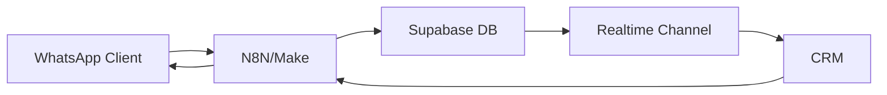

## Overview

The `webhookService` handles outgoing webhook notifications to external automation platforms (N8N, Make, Zapier) during order lifecycle events. This enables the CRM to trigger WhatsApp messages and other integrations when orders change state.

### System Architecture



**Flow:**
1. Customer sends WhatsApp message
2. N8N/Make receives and creates order in Supabase
3. CRM receives order via Realtime subscription
4. Admin updates order status in CRM
5. CRM sends webhook to N8N/Make
6. N8N/Make sends WhatsApp notification to customer

### Environment Variables

<ParamField path="VITE_WEBHOOK_BASE_URL" type="string" required>
  Base URL for webhook endpoints (e.g., `https://n8n.example.com`)
</ParamField>

<ParamField path="VITE_WEBHOOK_SECRET" type="string" required>
  Secret token for webhook authentication (sent in `x-webhook-secret` header)
</ParamField>

<Note>
If `VITE_WEBHOOK_BASE_URL` is not configured, webhook functions will log a warning and return `null` without making HTTP requests.
</Note>

---

## Functions

### webhookPedidoAceptado

Notifies that an order has been accepted and moved to kitchen.

```javascript
import { webhookPedidoAceptado } from '../services/webhookService';
import { updateEstadoPedido } from '../services/pedidosService';

const pedido = await updateEstadoPedido(orderId, 'cocina');
await webhookPedidoAceptado(pedido);
```

<ParamField path="pedido" type="object" required>
  Order object from `pedidos_picanteria` table
  
  <Expandable title="Required Fields">
    <ParamField path="id" type="uuid">
      Order ID
    </ParamField>
    <ParamField path="telefono" type="string">
      Customer phone number
    </ParamField>
    <ParamField path="cliente_nombre" type="string">
      Customer name
    </ParamField>
    <ParamField path="total_final" type="number | null">
      Final total (or `total_estimado`)
    </ParamField>
    <ParamField path="tipo_servicio" type="string">
      'delivery' or 'recojo'
    </ParamField>
    <ParamField path="direccion" type="string">
      Delivery address
    </ParamField>
  </Expandable>
</ParamField>

#### Webhook Endpoint

```
POST {VITE_WEBHOOK_BASE_URL}/webhook/pedido-aceptado
```

#### Payload

```json
{
  "pedidoId": "123e4567-e89b-12d3-a456-426614174000",
  "telefono": "+51987654321",
  "cliente": "Juan Pérez",
  "total": 45.50,
  "tipo": "delivery",
  "direccion": "Av. Principal 123",
  "timestamp": "2026-03-10T14:30:00.000Z"
}
```

#### Returns

<ResponseField name="response" type="object | null">
  JSON response from webhook endpoint, or `null` if webhook URL not configured
</ResponseField>

#### Behavior

- Sends order details to N8N/Make for WhatsApp notification
- Example message: "Tu pedido está en preparación"
- Includes `x-webhook-secret` header for authentication

---

### webhookPedidoListo

Notifies that an order is ready for pickup or delivery.

```javascript
import { webhookPedidoListo } from '../services/webhookService';
import { updateEstadoPedido } from '../services/pedidosService';

const pedido = await updateEstadoPedido(orderId, 'entregar');
await webhookPedidoListo(pedido);
```

<ParamField path="pedido" type="object" required>
  Order object (same structure as `webhookPedidoAceptado`)
</ParamField>

#### Webhook Endpoint

```
POST {VITE_WEBHOOK_BASE_URL}/webhook/pedido-listo
```

#### Payload

Same structure as `webhookPedidoAceptado`.

#### Returns

<ResponseField name="response" type="object | null">
  JSON response from webhook endpoint, or `null` if not configured
</ResponseField>

#### Behavior

- Triggers WhatsApp message: "Tu pedido está listo"
- For pickup orders: "Puedes recogerlo"
- For delivery: Prepares for dispatch

---

### webhookPedidoDespachado

Notifies that a delivery order has been dispatched.

```javascript
import { webhookPedidoDespachado } from '../services/webhookService';

await webhookPedidoDespachado(pedido);
```

<ParamField path="pedido" type="object" required>
  Order object (same structure as `webhookPedidoAceptado`)
</ParamField>

#### Webhook Endpoint

```
POST {VITE_WEBHOOK_BASE_URL}/webhook/pedido-despachado
```

#### Payload

Same structure as `webhookPedidoAceptado`.

#### Returns

<ResponseField name="response" type="object | null">
  JSON response from webhook endpoint, or `null` if not configured
</ResponseField>

#### Behavior

- Only used for delivery orders
- Triggers WhatsApp: "Tu pedido va en camino"
- May include estimated delivery time

---

### webhookPedidoCompletado

Notifies that an order has been completed.

```javascript
import { webhookPedidoCompletado } from '../services/webhookService';
import { updateEstadoPedido } from '../services/pedidosService';

const pedido = await updateEstadoPedido(orderId, 'completado');
await webhookPedidoCompletado(pedido);
```

<ParamField path="pedido" type="object" required>
  Order object (same structure as `webhookPedidoAceptado`)
</ParamField>

#### Webhook Endpoint

```
POST {VITE_WEBHOOK_BASE_URL}/webhook/pedido-completado
```

#### Payload

Same structure as `webhookPedidoAceptado`.

#### Returns

<ResponseField name="response" type="object | null">
  JSON response from webhook endpoint, or `null` if not configured
</ResponseField>

#### Behavior

- Final notification in order lifecycle
- Triggers thank you message to customer
- May request feedback or review

---

### webhookPedidoCancelado

Notifies that an order has been cancelled.

```javascript
import { webhookPedidoCancelado } from '../services/webhookService';
import { cancelarPedido } from '../services/pedidosService';

const pedido = await cancelarPedido(orderId);
await webhookPedidoCancelado(pedido);
```

<ParamField path="pedido" type="object" required>
  Order object (same structure as `webhookPedidoAceptado`)
</ParamField>

#### Webhook Endpoint

```
POST {VITE_WEBHOOK_BASE_URL}/webhook/pedido-cancelado
```

#### Payload

Same structure as `webhookPedidoAceptado`.

#### Returns

<ResponseField name="response" type="object | null">
  JSON response from webhook endpoint, or `null` if not configured
</ResponseField>

#### Behavior

- Notifies customer: "Tu pedido fue cancelado"
- May include cancellation reason
- Clears any pending automations for this order

---

### webhookFinalizarPedido

Production workflow to finalize an order (mark as delivered, send final message, clear memory).

```javascript
import { webhookFinalizarPedido } from '../services/webhookService';

await webhookFinalizarPedido(pedido);
```

<ParamField path="pedido" type="object" required>
  Order object
  
  <Expandable title="Required Fields">
    <ParamField path="id" type="uuid">
      Order ID
    </ParamField>
    <ParamField path="telefono" type="string">
      Customer phone number
    </ParamField>
  </Expandable>
</ParamField>

#### Webhook Endpoint

```
POST https://servidor-silva.canadacentral.cloudapp.azure.com/webhook/finalizar-pedido-picanteria
```

<Warning>
This endpoint uses a **hardcoded production URL** and does NOT use `VITE_WEBHOOK_BASE_URL`.
</Warning>

#### Payload

```json
{
  "pedido_id": "123e4567-e89b-12d3-a456-426614174000",
  "telefono": "+51987654321"
}
```

#### Returns

<ResponseField name="response" type="object | null">
  JSON response from production workflow, or `null` on error
</ResponseField>

#### Behavior

- Calls production N8N workflow
- Marks order as delivered in external system
- Sends final "buen provecho" message via WhatsApp
- Clears conversation memory/context
- Does NOT update Supabase database (handled by workflow)

#### Error Handling

Throws error with HTTP status and response text if request fails.

---

## Usage Examples

<CodeGroup>

```javascript Kanban Order Flow
import {
  webhookPedidoAceptado,
  webhookPedidoListo,
  webhookPedidoDespachado,
  webhookPedidoCompletado
} from '../services/webhookService';
import { updateEstadoPedido } from '../services/pedidosService';

async function avanzarEstado(pedidoId, estadoActual) {
  let nuevoEstado;
  let webhookFn;

  switch (estadoActual) {
    case 'pendiente':
      nuevoEstado = 'cocina';
      webhookFn = webhookPedidoAceptado;
      break;
    case 'cocina':
      nuevoEstado = 'entregar';
      webhookFn = webhookPedidoListo;
      break;
    case 'entregar':
      nuevoEstado = 'completado';
      webhookFn = webhookPedidoCompletado;
      break;
    default:
      throw new Error('Invalid state transition');
  }

  const pedidoActualizado = await updateEstadoPedido(pedidoId, nuevoEstado);
  await webhookFn(pedidoActualizado);

  return pedidoActualizado;
}
```

```javascript Dispatch Delivery
import { webhookPedidoDespachado } from '../services/webhookService';
import { updateEstadoPedido } from '../services/pedidosService';

async function despacharDelivery(pedido) {
  if (pedido.tipo_servicio !== 'delivery') {
    throw new Error('Only delivery orders can be dispatched');
  }

  if (pedido.estado_pedido !== 'entregar') {
    throw new Error('Order must be in "entregar" status');
  }

  // Optional: Update to a "en_camino" status if you have one
  // const actualizado = await updateEstadoPedido(pedido.id, 'en_camino');
  
  await webhookPedidoDespachado(pedido);
  console.log(`Delivery dispatched for order ${pedido.id}`);
}
```

```javascript Cancel with Notification
import { webhookPedidoCancelado } from '../services/webhookService';
import { cancelarPedido } from '../services/pedidosService';

async function cancelarConNotificacion(pedidoId) {
  try {
    const pedidoCancelado = await cancelarPedido(pedidoId);
    await webhookPedidoCancelado(pedidoCancelado);
    
    return {
      success: true,
      pedido: pedidoCancelado
    };
  } catch (error) {
    console.error('Failed to cancel order:', error);
    return {
      success: false,
      error: error.message
    };
  }
}
```

```javascript Finalize with Production Workflow
import { webhookFinalizarPedido } from '../services/webhookService';

async function finalizarEntrega(pedido) {
  if (pedido.estado_pedido !== 'completado') {
    throw new Error('Order must be completed first');
  }

  try {
    const resultado = await webhookFinalizarPedido(pedido);
    console.log('Order finalized:', resultado);
  } catch (error) {
    console.error('Failed to finalize order:', error.message);
    throw error;
  }
}
```

```javascript Error Handling
import { webhookPedidoAceptado } from '../services/webhookService';

async function aceptarPedidoConReintentos(pedido, maxReintentos = 3) {
  let intento = 0;
  
  while (intento < maxReintentos) {
    try {
      const resultado = await webhookPedidoAceptado(pedido);
      console.log('Webhook sent successfully');
      return resultado;
    } catch (error) {
      intento++;
      console.error(`Attempt ${intento} failed:`, error.message);
      
      if (intento >= maxReintentos) {
        console.error('Max retries reached. Webhook failed.');
        // Log to monitoring service
        throw error;
      }
      
      // Wait before retrying (exponential backoff)
      await new Promise(resolve => setTimeout(resolve, 1000 * Math.pow(2, intento)));
    }
  }
}
```

```javascript Webhook Without Base URL
import { webhookPedidoListo } from '../services/webhookService';

// If VITE_WEBHOOK_BASE_URL is not configured
const resultado = await webhookPedidoListo(pedido);
// Console warning: "[Webhook] VITE_WEBHOOK_BASE_URL no configurada. Evento no enviado"
// resultado === null

// This allows the CRM to work without webhooks for testing/development
```

</CodeGroup>

---

## N8N Integration Setup

<Steps>
  <Step title="Create Webhook Endpoints">
    In N8N, create a workflow with multiple webhook nodes:
    
    - `/webhook/pedido-aceptado`
    - `/webhook/pedido-listo`
    - `/webhook/pedido-despachado`
    - `/webhook/pedido-completado`
    - `/webhook/pedido-cancelado`
  </Step>
  
  <Step title="Validate Secret">
    Add a Function node to validate the `x-webhook-secret` header:
    
    ```javascript
    const secret = $request.headers['x-webhook-secret'];
    const expectedSecret = 'your-secret-token';
    
    if (secret !== expectedSecret) {
      $respond({
        status: 401,
        body: { error: 'Unauthorized' }
      });
      return [];
    }
    
    return [$input.item];
    ```
  </Step>
  
  <Step title="Send WhatsApp Message">
    Add a WhatsApp node (or HTTP Request to WhatsApp Business API):
    
    ```javascript
    const { telefono, cliente, pedidoId } = $json;
    
    return {
      to: telefono,
      message: `Hola ${cliente}, tu pedido ${pedidoId} está en preparación.`
    };
    ```
  </Step>
  
  <Step title="Configure Environment">
    Set environment variables in your CRM:
    
    ```bash
    VITE_WEBHOOK_BASE_URL=https://n8n.example.com
    VITE_WEBHOOK_SECRET=your-secret-token
    ```
  </Step>
</Steps>

---

## Security Considerations

<AccordionGroup>
  <Accordion title="Webhook Authentication">
    Always validate the `x-webhook-secret` header in your N8N/Make workflows:
    
    - Use a strong, randomly generated secret
    - Rotate secrets periodically
    - Store secrets in environment variables, not hardcoded
  </Accordion>
  
  <Accordion title="HTTPS Only">
    Never send webhooks over HTTP in production. Ensure:
    
    - `VITE_WEBHOOK_BASE_URL` uses `https://`
    - SSL/TLS certificates are valid
    - N8N/Make instance has HTTPS enabled
  </Accordion>
  
  <Accordion title="Rate Limiting">
    Implement rate limiting on webhook endpoints to prevent abuse:
    
    - Limit requests per IP address
    - Implement exponential backoff on client side
    - Monitor for unusual traffic patterns
  </Accordion>
</AccordionGroup>
