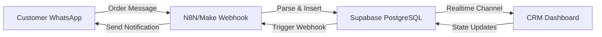

## System Overview

Lurwis CRM implements a **real-time, event-driven architecture** that connects WhatsApp messages to a React dashboard through webhook automation and Supabase's live database synchronization.

## High-Level Data Flow



<Steps>
  <Step title="Customer sends order via WhatsApp">
    A customer sends a message to the restaurant's WhatsApp number with their order details (e.g., "2 Ceviches + 1 Chicharrón de Pescado").
  </Step>

  <Step title="Webhook automation processes message">
    The WhatsApp Business API forwards the message to an N8N or Make.com workflow. The workflow:
    - Extracts customer phone number and name
    - Parses the order details using AI or pattern matching
    - Calculates estimated total
    - Formats the data as JSON
  </Step>

  <Step title="Order inserted into Supabase">
    The webhook workflow inserts a new row into the `pedidos_picanteria` table with:

    ```json
    {
      "telefono": "+51999123456",
      "cliente_nombre": "Juan Pérez",
      "detalle_pedido": [
        {"nombre": "Ceviche", "cantidad": 2, "precio": 20},
        {"nombre": "Chicharrón de Pescado", "cantidad": 1, "precio": 15}
      ],
      "total_estimado": 55.00,
      "metodo_pago": "Yape",
      "tipo_servicio": "delivery",
      "direccion": "Av. Larco 1234, Miraflores",
      "estado_pedido": "pendiente"
    }
    ```
  </Step>

  <Step title="Real-time subscription triggers in CRM">
    The CRM listens to Supabase Realtime subscriptions on the `pedidos_picanteria` table. When a new row is inserted, the dashboard receives the event **instantly** via WebSocket.

    Implementation in `src/hooks/usePedidosRealtime.js`:

    ```javascript src/hooks/usePedidosRealtime.js
    useEffect(() => {
      // Subscribe to INSERT events
      const channel = supabase
        .channel("pedidos-picanteria-realtime")
        .on("postgres_changes",
          { event: "INSERT", schema: "public", table: "pedidos_picanteria" },
          ({ new: nuevo }) => {
            // Add order to state if it's in active workflow
            if (COLUMN_ORDER.includes(nuevo.estado_pedido)) {
              setPedidos((prev) => [nuevo, ...prev]);
              // Show browser notification
              pushNuevoPedido(
                String(nuevo.id).slice(0, 8),
                nuevo.cliente_nombre,
                nuevo.total_final ?? nuevo.total_estimado
              );
            }
          }
        )
        .subscribe();

      return () => supabase.removeChannel(channel);
    }, [cargarPedidos]);
    ```
  </Step>

  <Step title="Order appears in Kanban board">
    The order card is rendered in the **Pendiente** (Pending) column of the Kanban board in the **Pedidos** page. Staff can now see all order details:
    - Customer name and phone
    - Order items with quantities
    - Total price
    - Payment method (Yape, Plin, Cash, Card)
    - Service type (Delivery or Pickup)
    - Delivery address (if applicable)
  </Step>

  <Step title="Admin updates order state">
    As the order progresses, staff click buttons to move it through workflow states:

    - **Pendiente** → **Cocina** (Accept order)
    - **Cocina** → **Entregar** (Mark as ready)
    - **Entregar** → **Completado** (Deliver/Complete)

    Each state change triggers:
    1. Database update via `src/services/pedidosService.js`
    2. Webhook notification to N8N/Make
    3. WhatsApp message to customer

    ```javascript src/hooks/usePedidosRealtime.js
    const avanzarEstado = useCallback(async (pedido) => {
      const idx = COLUMN_ORDER.indexOf(pedido.estado_pedido);
      const siguiente = COLUMN_ORDER[idx + 1];
      if (!siguiente) return;

      // Update in Supabase
      const actualizado = await updateEstadoPedido(pedido.id, siguiente);
      setPedidos((prev) =>
        prev.map((p) => (p.id === actualizado.id ? actualizado : p))
      );

      // Send webhook notification
      if (pedido.estado_pedido === "pendiente") 
        webhookPedidoAceptado(pedido).catch(console.warn);
      if (pedido.estado_pedido === "cocina") 
        webhookPedidoListo(pedido).catch(console.warn);
      if (pedido.estado_pedido === "entregar") {
        const fn = pedido.tipo_servicio === "delivery" 
          ? webhookPedidoDespachado 
          : webhookPedidoCompletado;
        fn(pedido).catch(console.warn);
      }
    }, []);
    ```
  </Step>

  <Step title="Customer receives WhatsApp updates">
    The webhook service sends notifications back to WhatsApp:

    - **Order Accepted**: "¡Tu pedido está en preparación! 🍽️"
    - **Order Ready**: "Tu pedido está listo para recoger/entregar 📦"
    - **Out for Delivery**: "Tu pedido va en camino 🛵"
    - **Completed**: "¡Disfruta tu comida! Gracias por tu preferencia 😊"

    Webhook implementation in `src/services/webhookService.js`:

    ```javascript src/services/webhookService.js
    const BASE_URL = import.meta.env.VITE_WEBHOOK_BASE_URL ?? "";
    const WH_SECRET = import.meta.env.VITE_WEBHOOK_SECRET ?? "";

    const sendWebhook = async (path, payload) => {
      if (!BASE_URL) {
        console.warn("[Webhook] BASE_URL not configured");
        return null;
      }
      const res = await fetch(`${BASE_URL}${path}`, {
        method: "POST",
        headers: {
          "Content-Type": "application/json",
          "x-webhook-secret": WH_SECRET,
        },
        body: JSON.stringify(payload),
      });
      if (!res.ok) throw new Error(`Webhook error ${res.status}`);
      return res.json().catch(() => null);
    };

    export const webhookPedidoAceptado = (p) => 
      sendWebhook("/webhook/pedido-aceptado", {
        pedidoId: p.id,
        telefono: p.telefono,
        cliente: p.cliente_nombre,
        total: p.total_final ?? p.total_estimado,
      });
    ```
  </Step>
</Steps>

## Component Architecture

### Frontend Structure

The React application follows a modular, context-driven architecture:

```
src/
├── lib/
│   └── supabase.js              # Supabase client singleton
├── context/
│   ├── AuthContext.jsx          # User authentication state
│   └── NotificationsContext.jsx # Browser notification system
├── services/
│   ├── authService.js           # Supabase Auth operations
│   ├── pedidosService.js        # Order CRUD operations
│   ├── platosService.js         # Dish management
│   └── webhookService.js        # Outbound webhook notifications
├── hooks/
│   ├── usePedidosRealtime.js    # Realtime order subscription
│   ├── useDashboard.js          # Dashboard KPI calculations
│   └── usePlatos.js             # Dish catalog management
├── pages/
│   ├── LoginPage.jsx            # Authentication UI
│   ├── DashboardPage.jsx        # Analytics and metrics
│   ├── PedidosPage.jsx          # Kanban board
│   ├── HistorialPage.jsx        # Order history
│   └── ConfiguracionPage.jsx    # Settings and dish editor
└── App.jsx                      # Route definitions
```

### Key Architectural Patterns

<CardGroup cols={2}>
  <Card title="Context API for Global State" icon="sitemap">
    `AuthContext` manages user sessions  
    `NotificationsContext` handles browser alerts
  </Card>
  <Card title="Custom Hooks for Data" icon="hook">
    `usePedidosRealtime` encapsulates Supabase subscriptions  
    `useDashboard` calculates analytics from raw data
  </Card>
  <Card title="Service Layer Abstraction" icon="layer-group">
    All Supabase queries isolated in `services/` folder  
    Components never import `supabase` directly
  </Card>
  <Card title="Protected Routes" icon="lock">
    `ProtectedRoute.jsx` wraps authenticated pages  
    Redirects to `/login` if no session exists
  </Card>
</CardGroup>

## Database Schema

### pedidos_picanteria Table

The core table storing all order information:

| Column | Type | Description |
|--------|------|-------------|
| `id` | UUID | Primary key, auto-generated |
| `telefono` | TEXT | Customer phone number |
| `cliente_nombre` | TEXT | Customer name |
| `detalle_pedido` | JSONB | Array of order items with quantities |
| `total_final` | NUMERIC | Final confirmed total |
| `total_estimado` | NUMERIC | Initial estimated total |
| `metodo_pago` | TEXT | Payment method (Yape, Plin, Cash, Card) |
| `tipo_servicio` | TEXT | Service type (delivery, pickup) |
| `direccion` | TEXT | Delivery address |
| `estado_pedido` | TEXT | Workflow state (pendiente, cocina, entregar, completado, cancelado) |
| `created_at` | TIMESTAMPTZ | Order creation timestamp |

### platos Table (Optional)

Catalog of available dishes:

| Column | Type | Description |
|--------|------|-------------|
| `id` | UUID | Primary key |
| `nombre` | TEXT | Dish name |
| `activo` | BOOLEAN | Whether dish is currently available |
| `created_at` | TIMESTAMPTZ | Record creation timestamp |

<Note>
The `platos` table is used for dish name normalization in analytics. If not present, the system will still function using raw order data.
</Note>

## Authentication Flow

Lurwis CRM uses Supabase Auth with email/password authentication:

```javascript src/services/authService.js
import { supabase } from "../lib/supabase";

export const signIn = async (email, password) => {
  const { data, error } = await supabase.auth.signInWithPassword({ 
    email, 
    password 
  });
  if (error) throw error;
  return data.user;
};

export const getSession = async () => {
  const { data, error } = await supabase.auth.getSession();
  if (error) throw error;
  return data.session;
};

export const onAuthStateChange = (callback) =>
  supabase.auth.onAuthStateChange((_event, session) => callback(session));
```

The `AuthContext` wraps the entire application and:
1. Checks for existing session on mount
2. Subscribes to auth state changes (login/logout/refresh)
3. Provides `user`, `login()`, and `logout()` to all components
4. Prevents rendering until session check completes (avoids login page flash)

## Real-time Synchronization

Supabase Realtime uses PostgreSQL's replication system to broadcast changes:

1. **Enable Realtime**: `ALTER PUBLICATION supabase_realtime ADD TABLE pedidos_picanteria;`
2. **Subscribe in React**: Create a channel and listen for `INSERT`, `UPDATE` events
3. **Handle Events**: Update local state when remote changes occur
4. **Cleanup**: Unsubscribe when component unmounts

<Warning>
Make sure Realtime is enabled for the `pedidos_picanteria` table. Without this, orders will only appear after manual refresh.
</Warning>

## Webhook Integration (Optional)

The webhook service sends order state changes to external automation platforms:

**Environment Variables:**
```bash
VITE_WEBHOOK_BASE_URL=https://your-n8n-instance.com
VITE_WEBHOOK_SECRET=your-secret-token
```

**Webhook Endpoints:**
- `POST /webhook/pedido-aceptado` - Order accepted
- `POST /webhook/pedido-listo` - Order ready
- `POST /webhook/pedido-despachado` - Order dispatched (delivery)
- `POST /webhook/pedido-completado` - Order completed
- `POST /webhook/pedido-cancelado` - Order canceled

**Request Format:**
```json
{
  "pedidoId": "123e4567-e89b-12d3-a456-426614174000",
  "telefono": "+51999123456",
  "cliente": "Juan Pérez",
  "total": 55.00,
  "tipo": "delivery",
  "direccion": "Av. Larco 1234",
  "timestamp": "2026-03-10T14:30:00Z"
}
```

If `VITE_WEBHOOK_BASE_URL` is not configured, the system logs a warning and continues without sending notifications.

## Dashboard Analytics

The dashboard calculates real-time KPIs from order data in `src/hooks/useDashboard.js`:

- **Total Revenue**: Sum of `total_final` for completed orders
- **Average Ticket**: Total revenue ÷ number of orders
- **Success Rate**: (Completed orders ÷ Total orders) × 100
- **Top 5 Dishes**: Aggregated from `detalle_pedido` JSONB field
- **Peak Hours**: Order count grouped by hour (9 AM - 6 PM)
- **Payment Methods**: Distribution of Yape, Plin, Cash, Card
- **Service Type**: Delivery vs Pickup percentage

All calculations happen client-side after fetching raw order data, avoiding complex SQL queries and potential timezone issues.

## Security Considerations

<Warning>
**Never commit `.env` files to version control.** Always use `.env.example` templates and add `.env` to `.gitignore`.
</Warning>

- **Row Level Security**: Implement RLS policies in Supabase to restrict data access
- **Anon Key Safety**: The `SUPABASE_ANON_KEY` is safe to expose in frontend code (it's public)
- **Service Role Key**: NEVER use the service role key in frontend code - it bypasses all RLS
- **Webhook Authentication**: Use `x-webhook-secret` header to verify webhook requests
- **HTTPS Only**: Always use HTTPS in production for Supabase and webhook URLs

## Deployment Recommendations

For production deployment:

1. **Build the application**: `npm run build`
2. **Deploy to Vercel/Netlify**: Configure environment variables in hosting platform
3. **Enable Supabase RLS**: Restrict table access to authenticated users only
4. **Configure CORS**: Add your domain to Supabase allowed origins
5. **Set up monitoring**: Track Realtime connection errors and webhook failures

<Note>
The project includes a `vercel.json` configuration file for zero-config Vercel deployment.
</Note>