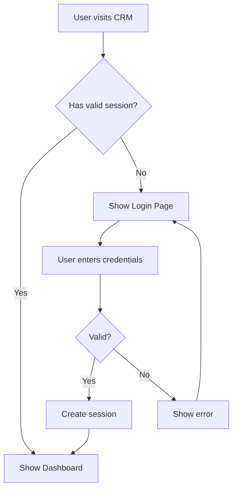

## Overview

Lurwis CRM uses Supabase Authentication to protect the admin dashboard. Only authenticated users can access the Kanban board, dashboard, and order history.

<Note>
  The authentication system is already implemented in the codebase. This guide shows you how to configure it in Supabase.
</Note>

## Supabase Auth Setup

<Steps>
  <Step title="Enable Email Authentication">
    1. Go to your Supabase project dashboard
    2. Navigate to **Authentication** → **Providers**
    3. Ensure **Email** is enabled (it's enabled by default)
  </Step>
  
  <Step title="Configure Email Settings (Optional)">
    For production, configure SMTP settings:
    
    1. Go to **Authentication** → **Email Templates**
    2. Configure your SMTP provider (SendGrid, AWS SES, etc.)
    3. Customize email templates for password resets
    
    <Note>
      For development, Supabase uses their default email service (emails may go to spam).
    </Note>
  </Step>
  
  <Step title="Create Admin User">
    Two methods to create your first admin user:
    
    <Tabs>
      <Tab title="Via Dashboard (Recommended)">
        1. Go to **Authentication** → **Users**
        2. Click **Invite user**
        3. Enter email address
        4. User receives email to set password
      </Tab>
      
      <Tab title="Via SQL">
        Run this in your SQL Editor:
        
        ```sql
        -- Create user directly (bypasses email verification)
        INSERT INTO auth.users (email, encrypted_password, email_confirmed_at)
        VALUES (
          'admin@yourcompany.com',
          crypt('your-secure-password', gen_salt('bf')),
          NOW()
        );
        ```
        
        <Warning>
          Only use this method for development. Production users should verify emails.
        </Warning>
      </Tab>
    </Tabs>
  </Step>
</Steps>

## Authentication Flow

The CRM implements a complete authentication flow:



### How it Works

<Steps>
  <Step title="Session Check">
    On app load, `AuthContext` checks for existing session:
    
    ```javascript
    // src/context/AuthContext.jsx:17-22
    getSession()
      .then((session) => setUser(session?.user ?? null))
      .catch(() => setUser(null))
      .finally(() => setLoading(false));
    ```
  </Step>
  
  <Step title="Login Process">
    User enters email/password, calls `signIn` from authService:
    
    ```javascript
    // src/services/authService.js:15-18
    const { data, error } = await supabase.auth.signInWithPassword({ 
      email, 
      password 
    });
    ```
  </Step>
  
  <Step title="Session Management">
    Supabase handles JWT tokens automatically:
    - Access token stored in localStorage
    - Auto-refresh before expiration
    - Session synced across browser tabs
  </Step>
  
  <Step title="Logout">
    Clear session and redirect to login:
    
    ```javascript
    // src/services/authService.js:22-24
    const { error } = await supabase.auth.signOut();
    ```
  </Step>
</Steps>

## Using Authentication in Code

### Access Current User

```javascript
import { useAuth } from '../context/AuthContext';

function MyComponent() {
  const { user, login, logout, loading } = useAuth();
  
  if (loading) return <div>Loading...</div>;
  
  if (!user) {
    return <div>Please log in</div>;
  }
  
  return (
    <div>
      <p>Welcome, {user.email}</p>
      <button onClick={logout}>Logout</button>
    </div>
  );
}
```

### Protect Routes

The CRM uses a `PrivateRoute` wrapper (see `src/App.jsx`):

```javascript
import { Navigate } from 'react-router-dom';
import { useAuth } from './context/AuthContext';

function PrivateRoute({ children }) {
  const { user, loading } = useAuth();
  
  if (loading) {
    return <div>Loading...</div>;
  }
  
  return user ? children : <Navigate to="/login" />;
}

// Usage in routes
<Route path="/dashboard" element={
  <PrivateRoute>
    <Dashboard />
  </PrivateRoute>
} />
```

### Listen for Auth State Changes

```javascript
import { useEffect } from 'react';
import { onAuthStateChange } from './services/authService';

function App() {
  useEffect(() => {
    const { data: { subscription } } = onAuthStateChange((session) => {
      if (session) {
        console.log('User logged in:', session.user.email);
      } else {
        console.log('User logged out');
      }
    });
    
    return () => subscription.unsubscribe();
  }, []);
}
```

## Session Configuration

### Token Expiration

By default, Supabase JWTs expire after 1 hour. Configure in Supabase dashboard:

1. Go to **Authentication** → **Settings**
2. Scroll to **JWT expiry limit**
3. Set your desired expiration (3600 seconds = 1 hour)

<Warning>
  Shorter expiration = more secure, but users must re-login more frequently.
</Warning>

### Auto-Refresh

Supabase automatically refreshes tokens before expiration. No configuration needed.

## Security Best Practices

<Steps>
  <Step title="Use Strong Passwords">
    Enforce minimum password requirements:
    
    1. Go to **Authentication** → **Policies**
    2. Set minimum password length (recommended: 12+ characters)
    3. Optionally require uppercase, numbers, symbols
  </Step>
  
  <Step title="Enable Email Confirmation">
    Require users to verify email before accessing CRM:
    
    1. **Authentication** → **Settings**
    2. Enable "Confirm email"
    3. Users must click link in email before first login
  </Step>
  
  <Step title="Set Up Row Level Security">
    Combine auth with RLS to protect data:
    
    ```sql
    -- Only allow authenticated users to read orders
    CREATE POLICY "Authenticated users can read orders"
    ON pedidos_picanteria
    FOR SELECT
    TO authenticated
    USING (true);
    
    -- Only allow authenticated users to update orders
    CREATE POLICY "Authenticated users can update orders"
    ON pedidos_picanteria
    FOR UPDATE
    TO authenticated
    USING (true);
    ```
  </Step>
  
  <Step title="Limit Login Attempts (Coming Soon)">
    Supabase provides built-in rate limiting. Configure in:
    
    **Authentication** → **Rate Limits**
  </Step>
</Steps>

## Multi-User Management

### Add More Admin Users

<Steps>
  <Step title="Invite via Dashboard">
    1. **Authentication** → **Users** → **Invite user**
    2. Enter new admin's email
    3. They receive invitation to set password
  </Step>
  
  <Step title="Manage User Roles (Optional)">
    For advanced role-based access:
    
    ```sql
    -- Create profiles table
    CREATE TABLE profiles (
      id uuid PRIMARY KEY REFERENCES auth.users(id),
      role varchar NOT NULL DEFAULT 'admin',
      created_at timestamptz DEFAULT now()
    );
    
    -- Automatically create profile on user signup
    CREATE FUNCTION public.handle_new_user()
    RETURNS trigger AS $$
    BEGIN
      INSERT INTO public.profiles (id, role)
      VALUES (new.id, 'admin');
      RETURN new;
    END;
    $$ LANGUAGE plpgsql SECURITY DEFINER;
    
    CREATE TRIGGER on_auth_user_created
      AFTER INSERT ON auth.users
      FOR EACH ROW EXECUTE FUNCTION public.handle_new_user();
    ```
  </Step>
</Steps>

### Remove User Access

1. **Authentication** → **Users**
2. Find the user
3. Click **Delete user**

<Warning>
  This permanently removes the user. They cannot log in again unless re-invited.
</Warning>

## Troubleshooting

### "Invalid login credentials"

- Verify email is correct
- Check password (case-sensitive)
- Ensure user exists in **Authentication** → **Users**
- Confirm email is verified (if email confirmation enabled)

### Session not persisting

- Check browser localStorage is not disabled
- Verify `VITE_SUPABASE_URL` and `VITE_SUPABASE_ANON_KEY` are correct
- Ensure cookies are not blocked

### User stuck in loading state

- Check browser console for errors
- Verify Supabase project is not paused
- Check network tab for failed requests to Supabase

### Password reset not working

- Verify SMTP settings in **Authentication** → **Email Templates**
- Check spam folder for reset email
- For development, use Supabase dashboard to manually reset password

## Code Reference

Authentication is implemented across these files:

<CardGroup cols={2}>
  <Card title="authService.js" icon="code">
    Core auth functions: `signIn`, `signOut`, `getSession`
    
    Location: `src/services/authService.js`
  </Card>
  
  <Card title="AuthContext.jsx" icon="react">
    React context for auth state management
    
    Location: `src/context/AuthContext.jsx`
  </Card>
  
  <Card title="supabase.js" icon="database">
    Supabase client initialization
    
    Location: `src/lib/supabase.js`
  </Card>
  
  <Card title="App.jsx" icon="route">
    Route protection with `PrivateRoute` component
    
    Location: `src/App.jsx`
  </Card>
</CardGroup>

## Testing Authentication

### Manual Testing

<Steps>
  <Step title="Test Login">
    1. Navigate to `/login`
    2. Enter valid credentials
    3. Should redirect to dashboard
  </Step>
  
  <Step title="Test Session Persistence">
    1. Log in successfully
    2. Refresh the page
    3. Should remain logged in
  </Step>
  
  <Step title="Test Logout">
    1. Click logout button
    2. Should redirect to login page
    3. Attempting to visit `/dashboard` should redirect to login
  </Step>
  
  <Step title="Test Protected Routes">
    1. Log out
    2. Try accessing `/dashboard` directly
    3. Should redirect to `/login`
  </Step>
</Steps>

### Automated Testing

```javascript
// Example test with Vitest + React Testing Library
import { render, screen, waitFor } from '@testing-library/react';
import { AuthProvider } from './context/AuthContext';
import { signIn } from './services/authService';

test('logs in user and shows dashboard', async () => {
  await signIn('admin@test.com', 'password123');
  
  render(
    <AuthProvider>
      <App />
    </AuthProvider>
  );
  
  await waitFor(() => {
    expect(screen.getByText(/dashboard/i)).toBeInTheDocument();
  });
});
```

## Next Steps

- [Configure environment variables](/configuration/environment-variables) for Supabase connection
- [Set up Row Level Security](/configuration/supabase-setup#row-level-security-optional) to secure data
- [Test the complete flow](/quickstart) from login to order management
