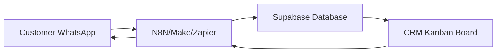

## Overview

Lurwis CRM integrates with webhook automation platforms to enable two-way communication with customers via WhatsApp. Orders flow in from WhatsApp → N8N → Supabase → CRM, and status updates flow back from CRM → N8N → WhatsApp.

## Architecture Flow



<Steps>
  <Step title="Incoming Orders">
    Customer sends WhatsApp message → N8N receives → Parses order → Inserts into Supabase → CRM receives via Realtime
  </Step>
  
  <Step title="Outgoing Updates">
    Staff updates order in CRM → Webhook sent to N8N → N8N sends WhatsApp message → Customer notified
  </Step>
</Steps>

## Webhook Configuration

Set these environment variables (see [Environment Variables](/configuration/environment-variables)):

```bash
VITE_WEBHOOK_BASE_URL=https://your-n8n-instance.com
VITE_WEBHOOK_SECRET=your-secret-token
```

## Outgoing Webhook Events

The CRM sends webhooks when order status changes. All requests:
- Use `POST` method
- Include `Content-Type: application/json` header
- Include `x-webhook-secret` header for authentication

### Event Endpoints

<ParamField path="/webhook/pedido-aceptado" type="POST">
  **Triggered when:** Order moves from `pendiente` → `cocina`
  
  **Use case:** Notify customer their order is being prepared
  
  **Payload:**
  ```json
  {
    "pedidoId": "abc123-def456-789",
    "telefono": "+51987654321",
    "cliente": "Juan Pérez",
    "total": 45.50,
    "tipo": "delivery",
    "direccion": "Av. Principal 123",
    "timestamp": "2024-03-15T10:30:00.000Z"
  }
  ```
</ParamField>

<ParamField path="/webhook/pedido-listo" type="POST">
  **Triggered when:** Order moves from `cocina` → `entregar`
  
  **Use case:** Notify customer their order is ready for pickup/delivery
  
  **Payload:** Same structure as `pedido-aceptado`
</ParamField>

<ParamField path="/webhook/pedido-despachado" type="POST">
  **Triggered when:** Delivery order moves from `entregar` → `completado`
  
  **Use case:** Notify customer their order is on the way
  
  **Payload:** Same structure as `pedido-aceptado`
  
  <Note>
    Only triggered for `tipo_servicio: "delivery"`. Pickup orders skip this and go directly to `pedido-completado`.
  </Note>
</ParamField>

<ParamField path="/webhook/pedido-completado" type="POST">
  **Triggered when:** Pickup order moves from `entregar` → `completado`
  
  **Use case:** Notify customer their order is complete (pickup only)
  
  **Payload:** Same structure as `pedido-aceptado`
</ParamField>

<ParamField path="/webhook/pedido-cancelado" type="POST">
  **Triggered when:** Order is cancelled from any state
  
  **Use case:** Notify customer their order was cancelled
  
  **Payload:** Same structure as `pedido-aceptado`
</ParamField>

### Special Endpoint: Finalize Order

<Warning>
  This endpoint is **hardcoded** to a production URL and does not use `VITE_WEBHOOK_BASE_URL`.
</Warning>

<ParamField path="https://servidor-silva.canadacentral.cloudapp.azure.com/webhook/finalizar-pedido-picanteria" type="POST">
  **Triggered when:** Order reaches `completado` state
  
  **Purpose:** 
  - Send "Enjoy your meal" message to customer
  - Clear conversation memory in N8N workflow
  
  **Payload:**
  ```json
  {
    "pedido_id": "abc123-def456-789",
    "telefono": "+51987654321"
  }
  ```
  
  **Location in code:** `src/services/webhookService.js:84-95`
</ParamField>

## Payload Field Reference

<ParamField path="pedidoId" type="string">
  UUID of the order (from `pedidos_picanteria.id`)
</ParamField>

<ParamField path="telefono" type="string">
  Customer's phone number in international format
</ParamField>

<ParamField path="cliente" type="string">
  Customer's name
</ParamField>

<ParamField path="total" type="number">
  Order total (`total_final` if available, otherwise `total_estimado`)
</ParamField>

<ParamField path="tipo" type="string">
  Service type: `"delivery"` or `"recojo"`
</ParamField>

<ParamField path="direccion" type="string | null">
  Delivery address, or `null` if address is "Sin dirección"
</ParamField>

<ParamField path="timestamp" type="string">
  ISO 8601 timestamp when the webhook was sent
</ParamField>

## N8N Workflow Example

Here's a sample N8N workflow to handle order status updates:

<Steps>
  <Step title="Create Webhook Node">
    1. Add a "Webhook" node
    2. Set path to `/webhook/pedido-aceptado`
    3. Method: `POST`
    4. Response mode: `On Received`
  </Step>
  
  <Step title="Validate Secret">
    Add a "Function" node to verify the secret:
    
    ```javascript
    const receivedSecret = $request.headers['x-webhook-secret'];
    const expectedSecret = 'your-webhook-secret';
    
    if (receivedSecret !== expectedSecret) {
      throw new Error('Unauthorized webhook request');
    }
    
    return items;
    ```
  </Step>
  
  <Step title="Send WhatsApp Message">
    Add a WhatsApp node (or HTTP node for WhatsApp API):
    
    ```javascript
    // Example message template
    const { cliente, pedidoId } = $json;
    const message = `¡Hola ${cliente}! Tu pedido #${pedidoId.slice(0, 8)} está siendo preparado. Te avisaremos cuando esté listo.`;
    ```
  </Step>
</Steps>

## Authentication

All outgoing webhooks include an `x-webhook-secret` header:

```javascript
headers: {
  "Content-Type": "application/json",
  "x-webhook-secret": "your-configured-secret"
}
```

**Validate this in your webhook receiver:**

<CodeGroup>
```javascript N8N Function Node
const receivedSecret = $request.headers['x-webhook-secret'];
const expectedSecret = $env.WEBHOOK_SECRET;

if (receivedSecret !== expectedSecret) {
  throw new Error('Invalid webhook secret');
}
```

```javascript Express.js
app.post('/webhook/pedido-aceptado', (req, res) => {
  const receivedSecret = req.headers['x-webhook-secret'];
  
  if (receivedSecret !== process.env.WEBHOOK_SECRET) {
    return res.status(401).json({ error: 'Unauthorized' });
  }
  
  // Process webhook...
});
```

```python Flask
@app.route('/webhook/pedido-aceptado', methods=['POST'])
def pedido_aceptado():
    received_secret = request.headers.get('x-webhook-secret')
    
    if received_secret != os.getenv('WEBHOOK_SECRET'):
        return jsonify({'error': 'Unauthorized'}), 401
    
    # Process webhook...
```
</CodeGroup>

## Error Handling

Webhooks are **non-blocking** and errors are logged to console:

```javascript
// From src/hooks/usePedidosRealtime.js
webhookPedidoAceptado(pedido).catch(console.warn);
```

<Note>
  If a webhook fails, the order status will still update in the CRM. The webhook system is designed to be fault-tolerant.
</Note>

### What happens if webhook fails:

- Order continues through the Kanban workflow normally
- Error is logged to browser console
- Customer does not receive WhatsApp notification for that specific event
- Subsequent status changes will still attempt to send webhooks

## Testing Webhooks

### Using RequestBin

<Steps>
  <Step title="Create a RequestBin">
    Go to [https://requestbin.com](https://requestbin.com) and create a new bin
  </Step>
  
  <Step title="Set webhook URL">
    ```bash
    VITE_WEBHOOK_BASE_URL=https://your-bin.requestbin.com
    VITE_WEBHOOK_SECRET=test-secret
    ```
  </Step>
  
  <Step title="Trigger an event">
    Move an order through the Kanban board and check RequestBin for the payload
  </Step>
</Steps>

### Using ngrok for Local Testing

```bash
# Start ngrok
ngrok http 3000

# Use the ngrok URL
VITE_WEBHOOK_BASE_URL=https://abc123.ngrok.io
```

## Disabling Webhooks

To disable webhook sending (useful for local development):

```bash
# Simply don't set VITE_WEBHOOK_BASE_URL
# Or set it to empty string
VITE_WEBHOOK_BASE_URL=
```

<Note>
  The CRM will log a warning but continue functioning normally without webhooks.
</Note>

## WhatsApp Integration Platforms

<CardGroup cols={3}>
  <Card title="N8N" icon="diagram-project">
    Self-hosted automation platform with WhatsApp nodes
  </Card>
  
  <Card title="Make" icon="shuffle">
    Cloud automation with native WhatsApp Business API integration
  </Card>
  
  <Card title="Zapier" icon="bolt">
    Popular automation platform with WhatsApp via third-party apps
  </Card>
</CardGroup>

## Next Steps

- [Set up Supabase Realtime](/configuration/supabase-setup#enable-realtime) to receive incoming orders
- [Configure Environment Variables](/configuration/environment-variables) for webhook authentication
- Review the [code implementation](/configuration/webhooks#code-reference) in `src/services/webhookService.js`

## Code Reference

The webhook service is implemented in `src/services/webhookService.js`. Key functions:

- `webhookPedidoAceptado()` - Line 67
- `webhookPedidoListo()` - Line 70
- `webhookPedidoDespachado()` - Line 73
- `webhookPedidoCompletado()` - Line 76
- `webhookPedidoCancelado()` - Line 79
- `webhookFinalizarPedido()` - Line 86
