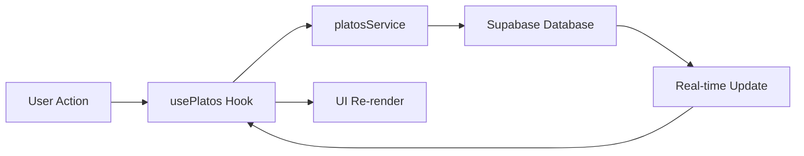

## Overview

The **Configuración** (Configuration) page provides a complete interface for managing your restaurant's menu. You can add, edit, enable/disable, and delete dishes organized by category, with support for multiple price sizes per dish.

<Note>
  All changes are applied directly to the Supabase database and take effect immediately across the system.
</Note>

## Accessing the Configuration Page

Navigate to `/config` or click **Configuración** in the sidebar navigation.

**User Requirements:**
- Must be authenticated with Supabase Auth
- Protected route - requires valid session

## Menu Structure

The menu is organized into three levels:

<Steps>
  <Step title="Categories">
    Top-level grouping (e.g., "Entradas", "Platos de Fondo", "Bebidas")
  </Step>
  <Step title="Dishes">
    Individual menu items with name, description, and availability status
  </Step>
  <Step title="Prices">
    Multiple size/price combinations per dish (Personal, Único, Familiar)
  </Step>
</Steps>

## Key Features

<CardGroup cols={2}>
  <Card title="Create Dishes" icon="plus">
    Add new menu items with name, description, and category
  </Card>
  <Card title="Edit Details" icon="pen-to-square">
    Update dish names, descriptions, and category assignments
  </Card>
  <Card title="Toggle Availability" icon="toggle-on">
    Enable or disable dishes without deleting them
  </Card>
  <Card title="Manage Prices" icon="dollar-sign">
    Set multiple prices per dish for different serving sizes
  </Card>
</CardGroup>

## Creating a New Dish

Click the **+ Nuevo Plato** button for a category to open the creation modal.

<Steps>
  <Step title="Enter Basic Information">
    - **Nombre**: Required. Dish name as it appears on orders
    - **Descripción**: Optional. Brief description or ingredients
    - **Categoría**: Pre-filled with the selected category, can be changed
  </Step>
  
  <Step title="Save the Dish">
    Click **Guardar** to create the dish. The modal closes and the dish appears in the table.
  </Step>
  
  <Step title="Add Prices">
    After creating the dish, you'll need to add at least one price using the `usePlatos` hook or directly through the `platosService`.
  </Step>
</Steps>

**Implementation:**

```javascript src/pages/ConfiguracionPage.jsx:247-249
const handleSave = async (form) => {
  if (modal.mode === "new") {
    await agregar({ 
      nombre: form.nombre, 
      descripcion: form.descripcion, 
      categoria_id: form.categoria_id 
    });
  }
};
```

## Editing a Dish

Click the **edit** icon (pencil) on any dish row to open the edit modal.

**Editable Fields:**
- Dish name
- Description
- Category assignment

**Non-Editable:**
- Availability status (use toggle switch)
- Prices (requires separate price management)

```javascript src/pages/ConfiguracionPage.jsx:251
await editar(modal.plato.id, { 
  nombre: form.nombre, 
  descripcion: form.descripcion, 
  categoria_id: form.categoria_id 
});
```

## Toggling Availability

Use the toggle switch in the **Disponible** column to enable or disable dishes.

**Behavior:**
- **Active (blue)**: Dish is available for orders
- **Inactive (gray)**: Dish is hidden from order system but not deleted
- Changes apply immediately

```javascript src/pages/ConfiguracionPage.jsx:244
const { toggleDisp } = usePlatos();

// In the table row
<ToggleSwitch
  id={`toggle-${plato.id}`}
  checked={plato.activo}
  onChange={() => toggleDisp(plato.id, !plato.activo)}
/>
```

<Tip>
  Disabling dishes is reversible. Use this instead of deletion for seasonal items or temporarily unavailable dishes.
</Tip>

## Deleting a Dish

Click the **delete** icon (trash can) on any dish row to permanently remove it.

<Warning>
  Deletion is **irreversible** and removes the dish and all associated prices from the database. A confirmation prompt appears before deletion.
</Warning>

```javascript src/pages/ConfiguracionPage.jsx:255-262
const handleDelete = async (id) => {
  if (!window.confirm("¿Eliminar este plato? Esta acción no se puede deshacer.")) 
    return;
  try {
    await eliminar(id);
  } catch (e) {
    alert("Error al eliminar: " + e.message);
  }
};
```

## Display Layout

Dishes are grouped by category in collapsible sections:

**Section Header:**
- Category name
- Dish count
- **+ Nuevo Plato** button
- Expand/collapse icon

**Dish Table Columns:**
1. **Nombre**: Dish name (bold)
2. **Descripción**: Optional description (truncated if long)
3. **Disponible**: Toggle switch for availability
4. **Acciones**: Edit and delete buttons

**Empty State:**

If a category has no dishes, a message appears: "No hay platos en esta categoría"

## Price Management

While the Configuration page handles dish CRUD operations, price management is done programmatically through the `usePlatos` hook:

```javascript
const { editarPrecio } = usePlatos();

// Update a specific price
await editarPrecio(precioId, { 
  precio: 25.00, 
  tamanio: 'Personal' 
});
```

**Valid Price Sizes:**
- `Personal` - Individual serving
- `Único` - Single standard size
- `Familiar` - Large/family size

See [usePlatos hook documentation](/api/use-platos) for complete price management API.

## Data Flow



1. User clicks button (add/edit/toggle/delete)
2. `usePlatos` hook calls appropriate service function
3. `platosService` executes Supabase query
4. Database updates immediately
5. Hook state refreshes with new data
6. UI re-renders with updated dish list

## Related Pages

<CardGroup cols={2}>
  <Card title="usePlatos Hook" icon="plug" href="/api/use-platos">
    React hook for menu state management
  </Card>
  <Card title="Platos Service" icon="database" href="/api/platos-service">
    Underlying service functions for CRUD operations
  </Card>
</CardGroup>

## Troubleshooting

<Accordion title="Changes not appearing after save">
  **Solution:** Click the **Actualizar** (Refresh) button in the top-right to manually reload the menu. If the issue persists, check browser console for Supabase errors.
</Accordion>

<Accordion title="Cannot delete dish">
  **Possible causes:**
  - Database constraint: dish may be referenced in existing orders
  - Permission issue: verify Supabase RLS policies allow DELETE operations
  
  **Solution:** Consider disabling the dish instead of deleting it.
</Accordion>

<Accordion title="Toggle switch not responding">
  **Solution:** Ensure you have a stable network connection. The toggle calls `toggleDisponibilidadPlato` which requires an active database connection.
</Accordion>
